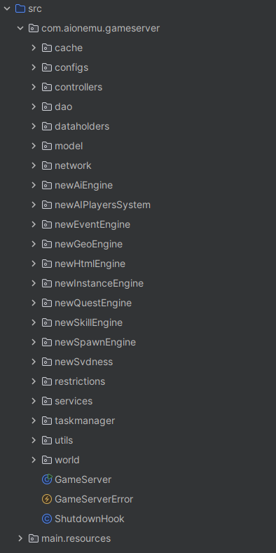
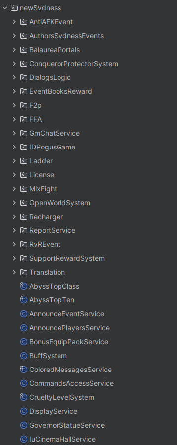
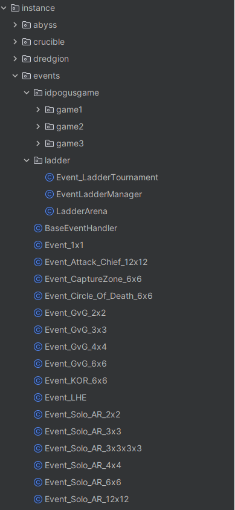
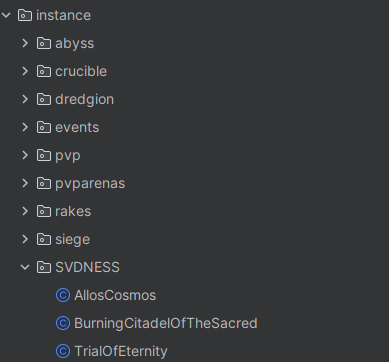

# 👋 SVDNESS
🇬🇧 English | [🇷🇺 Русский](README_RUS.md)
## About Me

## MMORPG Server Developer | Java Backend Developer

⚡ Passionate MMORPG developer focused on server-side systems, gameplay mechanics, database optimization, and web integration. ⚡

## Tech Stack
Java • MySQL • HikariCP • PHP • HTML • CSS • JavaScript • Linux  • Maven.

---

## Expertise

### MMORPG Development
- Aion Server Development.
- PvE Systems.
- PvP Systems.
- Instance Systems.
- Event Systems.
- Ranking Systems.
- Reward Systems.
- Performance Optimization.

### Website Development
- Landing Pages.
- User Panels.
- Donation Systems.
- Ranking Pages.
- Event Pages.
- Custom Integrations.

---

## Featured Systems
- Wheel Of Fortune.
- Daily Missions.
- Achievement System.
- Referral System.
- Battle Pass.
- Reward Events.
- Website Components.

---

## Current Project
Currently developing and maintaining a custom MMORPG project, including:
- Gameplay Systems.
- Backend Development.
- Website Development.
- Database Optimization.
- Performance Improvements.

---

## Portfolio
Repositories contain examples of systems, tools, and website components developed for MMORPG projects.

---

## Contact
💬   Feel free to open an Issue or Discussion for collaboration or Telegramm: https://t.me/svdness_aion_dev   💬
