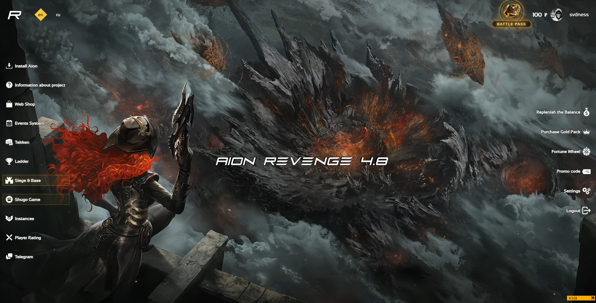

# 👋 SVDNESS
[🇬🇧 English](README.md) | 🇷🇺 Русский
## Обо мне

## Разработчик MMORPG-серверов | Java Backend Developer

⚡ Занимаюсь разработкой MMORPG-серверов, игровых механик, серверной логики, оптимизацией баз данных и веб-разработкой для игровых проектов. ⚡

## Технический стек
Java • MySQL • HikariCP • PHP • HTML • CSS • JavaScript • Linux  • Maven.

---

## Основные направления

### Разработка MMORPG
- Разработка серверов Aion.
- PvE системы.
- PvP системы.
- Инстансы.
- Игровые события.
- Рейтинговые системы.
- Системы наград.
- Оптимизация производительности.

### Веб-разработка
- Лендинги.
- Личные кабинеты.
- Донат-системы.
- Страницы рейтингов.
- Игровые события.
- Пользовательские интеграции.

---

## Реализованные системы
- Колесо Фортуны.
- Ежедневные задания.
- Система достижений.
- Реферальная система.
- Battle Pass.
- Системы наград и событий.
- Веб-компоненты.

---

## Текущий проект
В настоящее время занимаюсь разработкой и поддержкой собственного MMORPG-проекта, включая:
- Игровые механики.
- Серверную разработку.
- Веб-разработку.
- Оптимизацию баз данных.
- Улучшение производительности.

---

## Портфолио
В репозиториях представлены примеры игровых систем, инструментов и веб-компонентов для MMORPG-проектов.

---

## Контакты
💬   Для сотрудничества можно использовать GitHub Issues или Discussions или Telegram: https://t.me/svdness_aion_dev   💬
