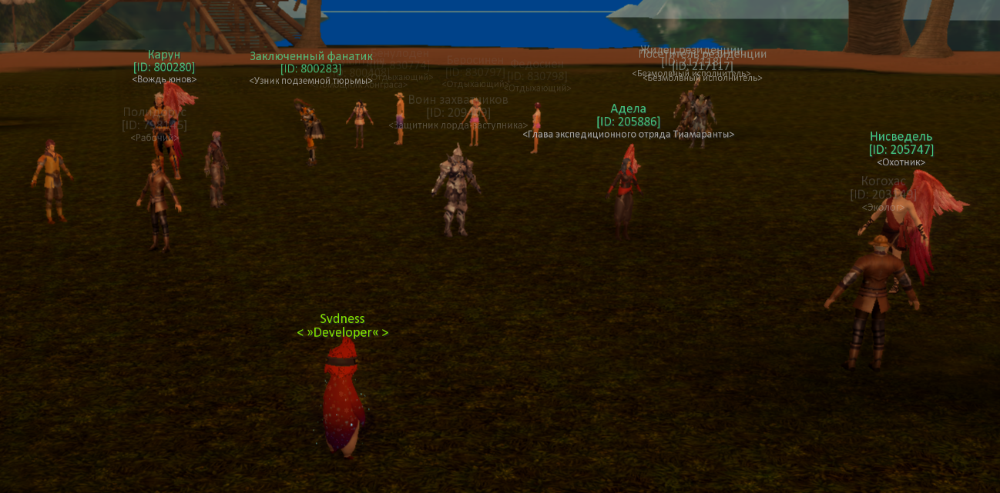

## Missing NPC state on server:

<npc_state_patch>
    <npc npc_id="203149" state="6"/>
    <npc npc_id="205747" state="5"/>
    <npc npc_id="205886" state="6"/>
    <npc npc_id="209409" state="5"/>
    <npc npc_id="798145" state="5"/>
    <npc npc_id="800238" state="5"/>
    <npc npc_id="800242" state="5"/>
    <npc npc_id="800280" state="5"/>
    <npc npc_id="800283" state="5"/>
    <npc npc_id="800408" state="5"/>
    <npc npc_id="830774" state="6"/>
    <npc npc_id="830797" state="6"/>
    <npc npc_id="830798" state="6"/>
    <npc npc_id="217117" state="6"/>
    <npc npc_id="217118" state="6"/>
</npc_state_patch>

## Python Script

import xml.etree.ElementTree as ET
from pathlib import Path
from collections import defaultdict, Counter

ROOT_DIR = Path(r"D:\AION_WORK\TEST_STATE_NPC")

SERVER_FILE = ROOT_DIR / "npc_templates.xml"

CLIENT_FILES = [
    ROOT_DIR / "client_npcs_npc.xml"
]

VALID_STATES = {"2", "3", "5", "6"}

def load_server_states():
    states = {}

    print("Loading server NPC templates...")

    tree = ET.parse(SERVER_FILE)
    root = tree.getroot()

    for npc in root.findall("npc_template"):

        npc_id = npc.get("npc_id")

        if not npc_id:
            continue

        state = npc.get("state")

        states[int(npc_id)] = state

    print(f"Loaded {len(states)} server NPCs")

    return states

def load_client_animations():
    data = {}

    print("Loading client NPC files...")

    for file in CLIENT_FILES:

        print(f"  -> {file.name}")

        tree = ET.parse(file)
        root = tree.getroot()

        for npc in root.findall("npc_client"):

            id_node = npc.find("id")

            if id_node is None:
                continue

            npc_id = int(id_node.text)

            idle_node = npc.find("idle_animation")
            talk_node = npc.find("talk_animation")

            idle = ""
            talk = ""

            if idle_node is not None and idle_node.text:
                idle = idle_node.text.strip()

            if talk_node is not None and talk_node.text:
                talk = talk_node.text.strip()

            data[npc_id] = {
                "idle": idle,
                "talk": talk
            }

    print(f"Loaded {len(data)} client NPCs")

    return data

def build_animation_database(server_states, client_data):

    animation_state_counter = defaultdict(Counter)

    for npc_id, state in server_states.items():

        if state not in VALID_STATES:
            continue

        if npc_id not in client_data:
            continue

        idle = client_data[npc_id]["idle"]
        talk = client_data[npc_id]["talk"]

        if idle:
            animation_state_counter[("idle", idle)][state] += 1

        if talk:
            animation_state_counter[("talk", talk)][state] += 1

    return animation_state_counter

def suggest_state(idle, talk, animation_db):

    votes = Counter()

    if idle:
        votes.update(animation_db.get(("idle", idle), {}))

    if talk:
        votes.update(animation_db.get(("talk", talk), {}))

    if not votes:
        return None, 0, {}

    best_state, count = votes.most_common(1)[0]

    total = sum(votes.values())

    confidence = round(count / total * 100, 1)

    return best_state, confidence, dict(votes)

def main():

    server_states = load_server_states()
    client_data = load_client_animations()

    animation_db = build_animation_database(
        server_states,
        client_data
    )

    report = []
    patch = []

    for npc_id, anim in client_data.items():

        current_state = server_states.get(npc_id)

        #
        # NPC без state
        #
        if current_state in VALID_STATES:
            continue

        idle = anim["idle"]
        talk = anim["talk"]

        if not idle and not talk:
            continue

        suggested_state, confidence, votes = suggest_state(
            idle,
            talk,
            animation_db
        )

        if not suggested_state:
            continue

        report.append(
            (
                npc_id,
                suggested_state,
                confidence,
                idle,
                talk,
                votes
            )
        )

        patch.append(
            (npc_id, suggested_state)
        )

    report.sort(key=lambda x: (-x[2], x[0]))

    with open(
            ROOT_DIR / "npc_missing_state_report.txt",
            "w",
            encoding="utf-8"
    ) as f:

        f.write("NPC STATE ANALYSIS\n")
        f.write("=" * 100 + "\n\n")

        for npc_id, state, conf, idle, talk, votes in report:

            f.write(f"NPC ID: {npc_id}\n")
            f.write(f"Suggested State: {state}\n")
            f.write(f"Confidence: {conf}%\n")
            f.write(f"Idle Animation: {idle}\n")
            f.write(f"Talk Animation: {talk}\n")
            f.write(f"Votes: {votes}\n")
            f.write("-" * 80 + "\n")

    with open(
            ROOT_DIR / "npc_state_patch.xml",
            "w",
            encoding="utf-8"
    ) as f:

        f.write("<npc_state_patch>\n")

        for npc_id, state in patch:
            f.write(
                f'    <npc npc_id="{npc_id}" state="{state}"/>\n'
            )

        f.write("</npc_state_patch>\n")

    print()
    print("Done.")
    print(f"Suggestions found: {len(report)}")
    print()
    print("Generated:")
    print(" - npc_missing_state_report.txt")
    print(" - npc_state_patch.xml")

if __name__ == "__main__":
    main()
	
## Image
