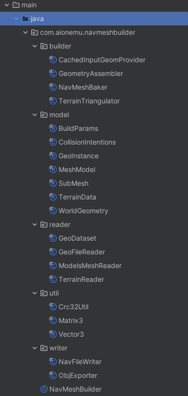
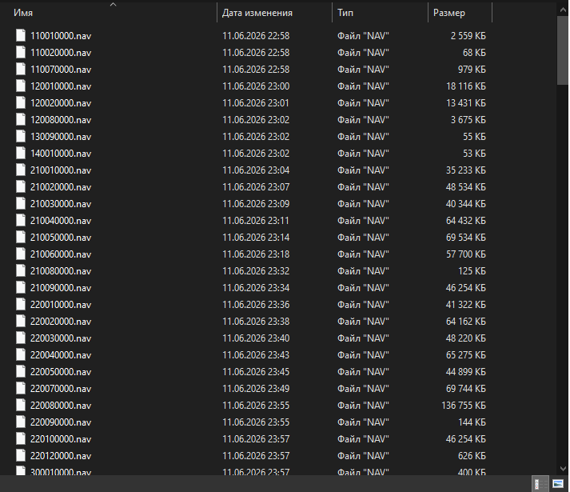

🇬🇧 English | [🇷🇺 Русский](README_RUS.md)

# NavMesh System — Aion Revenge 4.8

Navigation mesh system for correct obstacle avoidance of NPCs and mobs, built on top of the server's geo-data and the [recast4j](https://github.com/ppiastucki/recast4j) library.

---

## How It Works

### 1. Building .nav Files (SVD-NavMesh-Builder)

A standalone offline tool reads `.geo` files of game maps, assembles terrain and object geometry, and builds navigation meshes using the Recast algorithm. The result is saved as `.nav` files with a custom `SVNM` header containing map metadata, agent parameters, and source geometry CRC.

```
SVD-NavMesh-Builder
├── builder/   — NavMesh baking (NavMeshBaker, GeometryAssembler)
├── model/     — data models (WorldGeometry, TerrainData, MeshModel)
├── reader/    — .geo file reading (GeoFileReader, TerrainReader)
└── writer/    — .nav file writing (NavFileWriter)
```

### 2. Server Loading (NavMeshService)

On server startup, `NavMeshService` loads all `.nav` files from `data/navmesh/` in parallel. Each file is bound to a `mapId`. If the agent parameters in the file differ from the config, the server logs a warning and suggests rebuilding the `.nav` file.

### 3. Pathfinding (Detour)

When an NPC moves toward a target, `NpcMoveController` requests an obstacle-avoidance route from `NavMeshService`. The system converts Aion coordinates (Z-up) to the Recast coordinate system (Y-up), builds a path via `NavMeshQuery`, and returns a queue of waypoints.

```
moveToPoint(x, y, z)
    └── moveViaNavMesh()
            ├── NavMeshService.findPath() → List<Vector3f>
            ├── Waypoint queue → LinkedList<Point3D>
            └── NPC follows waypoints without walking through walls
```

### 4. Behavior When Target Is Unreachable

- If the target is inside un-meshed geometry — the NPC walks to the nearest reachable point and waits there, without clipping through walls.
- If no NavMesh exists for the map — fallback to straight-line movement.
- Forced movements (scripted, mechanical) always move in a straight line.
- If the target is within attack range but behind a wall — the NPC does not stand idle
  until give-up, but builds an obstacle-avoidance route (through a door, up a ramp)
  and continues chasing.
- Losing line-of-sight during a chase is expected behavior when NavMesh is enabled:
  the NPC rounds the corner/wall and catches up. Infinite chasing is prevented
  by distance and timers (`checkGiveUpDistance`).
---

## Stats

- **174 maps** covered by navigation meshes
- Parallel loading on server startup
- `NavMeshQuery` is created per request — fully thread-safe
- Path re-request throttling for moving targets: 500 ms

---

## Stack

- Java 25
- [recast4j](https://github.com/ppiastucki/recast4j) — pure Java Recast & Detour
- Maven


